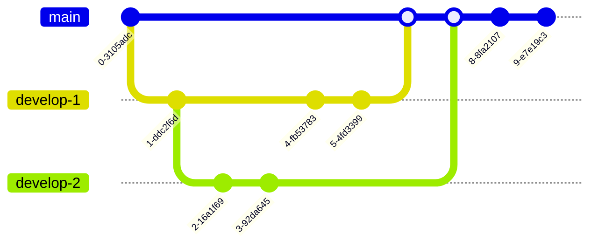

<center> <h2 style="color:Maroon;">Tips and Tricks</h2> </center>
<center> <h6 style="color:Maroon;">by Rashid</h6> </center>


<details>
<summary><b style="color:Maroon;">Windows Subsystem for Linux (WSL)</b></summary>

**Enable the Windows Subsystem for Linux:**
<sub>Open PowerShell as Administrator (Start menu > PowerShell > right-click > Run as Administrator) and enter this command or enable manually from Control Pannel:
<sub>

```powershell
dism.exe /online /enable-feature /featurename:Microsoft-Windows-Subsystem-Linux /all /norestart
dism.exe /online /enable-feature /featurename:VirtualMachinePlatform /all /norestart
sc config LxssManager start=auto
```

<sub>Install WSL command and set to WSL 2 by default<sub>

```powershell
wsl --install
wsl --update
wsl --status
wsl --version
wsl --set-default-version 2
```
<sub>Install Windows Subsystem for Linux (WSL) Distribution using Command<sub>

```powershell
wsl --list --online
# install distribution
wsl --install -d <distroName>
# list of distribution
wsl -l -v
# start distribution
wsl -d <distroName>
# logout distribution
wsl --terminate <distroName>
# uninstall distribution with below command and remove from app
wsl --unregister <distroName>
rm -rf <distro location>
```
<sub> default locaiton of online destro:: C:\Users\islam.rashidul\AppData\Local\Packages\CanonicalGroupLimited.Ubuntu22.04LTS_79rhkp1fndgsc\LocalState</sub>

**Enable same/different version multiple distribution in WSL**

```powershell
wsl -l -v
# export current distribution (Ubuntu-22.04)  
wsl --export Ubuntu-22.04 D:\Software\OS\wsl-distribution\ubuntu-empty.tar.gz
# import distribution (Ubuntu-test-base) from local
wsl --import Ubuntu-test-base D:\Software\OS\wsl-distribution\test-base D:\Software\OS\wsl-distribution\ubuntu-empty.tar.gz
wsl -d Ubuntu-test-base
# import distribution (Ubuntu-test-base-2) from local
wsl --import Ubuntu-test-base-2 D:\Software\OS\wsl-distribution\test-base-2 D:\Software\OS\wsl-distribution\ubuntu-empty.tar.gz
wsl -d Ubuntu-test-base-2
```
**or**
<sub>get distribution manually from below link<sub>

https://cloud-images.ubuntu.com/wsl/

<sub>Must use powershell and following command to download the Ubuntu WSL tarball</sub> 

```powershell
Remove-Item alias:curl
# cd to download location D:\Software\OS\wsl-distribution
curl (("https://cloud-images.ubuntu.com",
"wsl/jammy/current",
"ubuntu-jammy-wsl-amd64-wsl.rootfs.tar.gz") -join "/") `
--output ubuntu-jammy-wsl-amd64-wsl.rootfs.tar.gz 
# wsl --import <Distribution Name> <Installation Folder> <Ubuntu WSL2 Image Tarball path>
wsl --import Ubuntu-22.04-test D:\Software\OS\wsl-distribution\test-base-3 D:\Software\OS\wsl-distribution\ubuntu-jammy-wsl-amd64-wsl.rootfs.tar.gz
wsl -l -v
wsl -d Ubuntu-22.04-test
```

<sub>or other version<sub>

```powershell
Remove-Item alias:curl
# cd to download location D:\Software\OS\wsl-distribution
curl (("https://cloud-images.ubuntu.com",
"wsl/lunar/20231219",
"ubuntu-lunar-wsl-amd64-wsl.rootfs.tar.gz") -join "/") `
--output ubuntu-lunar-wsl-amd64-wsl.rootfs.tar.gz
# wsl --import <Distribution Name> <Installation Folder> <Ubuntu WSL2 Image Tarball path>
wsl --import Ubuntu-23.04-test D:\Software\OS\wsl-distribution\test-base-3 D:\Software\OS\wsl-distribution\ubuntu-lunar-wsl-amd64-wsl.rootfs.tar.gz
wsl -l -v
wsl -d Ubuntu-23.04-test
```
<sub>the environment that it has logged in as the root user instead of a custom user that you set up as part of the "base" environment. The custom user exists, but is not configured as the default. You can either start the environment using:<sub>

<a style="color:Maroon;">sample user: u-2304-wsl-node-01</a>


```bash
# add a new user to system:
NEW_USER=<USERNAME>
# add the user to the sudo group and set password:
useradd -m -G sudo -s /bin/bash "$NEW_USER"
passwd "$NEW_USER"
# switch to default instead of root
tee /etc/wsl.conf <<_EOF
[user]
default=${NEW_USER}
_EOF
```
<sub>/etc/resolv.conf file was automatically generated by WSL. To stop automatic generation of this file, add the following entry to /etc/wsl.conf:<sub>

```bash
# switch to default instead of root
tee /etc/wsl.conf <<_EOF
[network]
generateResolvConf = false
_EOF
```
<sub>systemd support and wsl configuration file /etc/wsl.conf<sub>

```bash
[boot]
systemd=true
```
<sub>verify systemctl<sub>

```bash
systemctl list-unit-files --type=service
```
<sub>Need to close WSL distribution using wsl.exe --shutdown from PowerShell<sub>

<sub>log out and log in again<sub>

```powershell
wsl --terminate <Distribution Name>
wsl -d <Distribution Name>
```

# /.wslconfig file in windows
```
[wsl2]
memory=6GB                  # Make sure you have this amount available to use!
swapFile=E:\\wsl2-swap.vhdx # I put mine off my SSD, but this is optional.

# Another option is to disable swap but if the VM goes out of memory, the
# OOM killer might start killing important processes or the VM may crash.
#
# Uncomment the line below this to use no swap file at all in the WSL 2 VM.
#swap=0
```

**Issues resolution**

* <sub>ping: www.google.com: Temporary failure in name resolution<sub>

```bash
sudo bash -c 'echo "nameserver 8.8.8.8" >> /etc/resolv.conf'
sudo bash -c 'echo "nameserver 8.8.4.4" >> /etc/resolv.conf'

# name resolution for robi
sudo bash -c 'echo "nameserver 10.101.11.67" >> /etc/resolv.conf'


# An IP address of 0.0.0.0 indicates no server is specified
sudo bash -c 'echo "nameserver 0.0.0.0" >> /etc/resolv.conf'
# change time zone
sudo timedatectl set-timezone Asia/Dhaka
```

</details>


<details>
<summary><b style="color:Maroon;">Docker on WSL and Ubuntu</b></summary>

**install Docker Engine on wsl**

https://docs.docker.com/engine/install/ubuntu/

<sub>Prepare system Remove Docker residue</sub>

```bash
sudo apt-get update
sudo apt-get upgrade
for pkg in docker.io docker-doc docker-compose docker-compose-v2 podman-docker containerd runc; do sudo apt-get remove $pkg; done
sudo apt remove docker-desktop
rm -r $HOME/.docker/desktop
sudo rm /usr/local/bin/com.docker.cli
sudo apt purge docker-desktop
```
<sub>Set up the Docker repository</sub>

```bash
# Add Docker's official GPG key:
sudo apt-get update
sudo apt-get install ca-certificates curl
sudo install -m 0755 -d /etc/apt/keyrings
sudo curl -fsSL https://download.docker.com/linux/ubuntu/gpg -o /etc/apt/keyrings/docker.asc
sudo chmod a+r /etc/apt/keyrings/docker.asc
```

```bash
# Add the repository to Apt sources:
echo \
  "deb [arch=$(dpkg --print-architecture) signed-by=/etc/apt/keyrings/docker.asc] https://download.docker.com/linux/ubuntu \
  $(. /etc/os-release && echo "$VERSION_CODENAME") stable" | \
  sudo tee /etc/apt/sources.list.d/docker.list > /dev/null
sudo apt-get update
```

<sub>To install the latest version, run:</sub>

```bash
sudo apt-get install docker-ce docker-ce-cli containerd.io docker-buildx-plugin docker-compose docker-compose-plugin
```
<sub>Or to install Specific version</sub>

```bash
apt-cache madison docker-ce | awk '{ print $3 }'
# list of version for example 5:24.0.0-1~ubuntu.22.04~jammy
VERSION_STRING=5:24.0.0-1~ubuntu.22.04~jammy
sudo apt-get install docker-ce=$VERSION_STRING docker-ce-cli=$VERSION_STRING containerd.io docker-buildx-plugin docker-compose-plugin
```
<sub>Start Docker service</sub>

```bash
sudo service docker start # or sudo systemctl docker start
sudo service docker status # or sudo systemctl docker status
```

<sub>run the hello-world image</sub>

```bash
sudo docker run hello-world
```

<sub>To run Docker without sudo, create a group docker for Docker users and add  current user to that group.</sub>

```bash
USER=<USERNAME> #u-2304-wsl-node-02
sudo groupadd docker

sudo usermod -aG docker $USER

newgrp docker
```

<Sub>If using a non-default WSL distribution, like a custom Linux distro, Docker might not start automatically when launch WSL. To ensure Docker starts every time open WSL, use the following commands:</Sub>

```bash
sudo systemctl enable docker.service
sudo systemctl enable containerd.service
```

**Expose Docker Engine on Windows**
<sub>To access the Docker Engine from Windows, need to configure remote access for Docker. There are two ways to do this, by modifying the docker daemon, or by overriding systemd launch configuration.</sub>


```bash
sudo systemctl edit docker.service
# Then add, or modify, the following lines
[Service]
ExecStart=/usr/bin/dockerd -H fd:// -H tcp://0.0.0.0:2375
# then need to restart the Docker service after below command
sudo systemctl daemon-reload
sudo systemctl restart docker.service
```


<Sub>if error "Docker is not running" found, reason this errors occurs is because Ubuntu 22.04 LTS uses iptables-nft by default. Need to switch to iptables-legacy so that Docker will work again:</Sub>

```bash
sudo update-alternatives --config iptables
# Enter 1 to select iptables-legacy
sudo service docker start
```
**Install Portainer CE with Docker on WSL / Docker Desktop**

```bash
# First, create the volume that Portainer Server will use to store its database:
docker volume create portainer_data
# download and install the Portainer Server container:
docker run -d -p 8000:8000 -p 9443:9443 --name portainer --restart=always -v /var/run/docker.sock:/var/run/docker.sock -v portainer_data:/data portainer/portainer-ce:latest
```

**Install docker desktop on ubuntu**

https://docs.docker.com/desktop/install/ubuntu/

<sub>To install docker desktop on nested ubuntu VM need do below steps:
-install ubuntu on hyper-V
-enable hyper-V from powershell
-check kvm in nested ubuntu
</sub>
</details>

<details>
<summary><b style="color:Maroon;">git</b></summary>

```bash
sudo apt install git
git config --global user.name "Your Name"
git config --global user.email "youremail@domain.com"
# ignore ssl verification
git config http.sslVerify false
git -c http.sslVerify=false clone "repository-name"
# set default editor
git config --global color.ui auto
git config --global core.editor "code --wait"
# auto-converting CRLF (carriage return[\r] & line feed[\n])
git config --global core.autocrlf false
git config --global diff.tool vscode
git config --global init.defaultBranch main
ssh-keygen -t ed25519 -C "your_email@example.com"
```

```powershell
# setup SSH in admin powershell
ssh-keygen -t ed25519 -C "rashed6585@gmail.com"
# start the ssh-agent in the background
Get-Service -Name ssh-agent | Set-Service -StartupType Manual
Start-Service ssh-agent
# add ssh
ssh-add C:\Users\rashe\.ssh\id_ed25519
```

```bash
# Copy the SSH public key to your clipboard.
clip < ~/.ssh/id_ed25519.pub

# or
cat ~/.ssh/id_ed25519.pub | clip

# or 
## sudo apt-get install xclip
## alias setclip="xclip -selection c"
## alias getclip="xclip -selection c -o"
cat ~/.ssh/id_ed25519.pub | setclip
getclip

# output
ssh-ed25519 AAAAC3NzaC1lZDI1NTE5BBBIPm9EOXSQ5fNYVtEz40NiggggI3FQZcVmZcuRHGoXqrht rashed6585@gmail.com
# Adding a new SSH key to your GitHub account in setup avater 
```





- create a repository in github eg. project-starship
- main fleet:
```bash
  mkdir project-starship
  echo "command on enterprise ship" > enterprise-fleet.txt
  git init
  git add .
  # or git add main-fleet.txt
  git status -s
  git commit -m "initial enterprise commit"
  echo "action on main ship" >> enterprise-fleet.txt
  git status -s
  git diff
  echo "repair action on main ship" > enterprise-fleet-repair.txt
  # -am is commit all modified files
  git commit -am "commit on enterprise fleet"
  git tag v0.1.0 -m "initial version"
  git log
  git show 234567 # hash name
  # add to remote branch
  git remote add origin https://github.com/rashed6585/project-starship.git
  git branch -M master
  git push -u origin master
  # add branch 
  git branch -M worker
  echo "maintenance on going with worker branch" >> enterprise-fleet-repair.txt
  git commit -m "worker branch created"
  git push -u origin worker
  git checkout -
  git commit -m "merge worker node"
  git merge worker
  # delete branch in local
  git branch -d worker
  # delete branch in remote
  git push https://github.com/rashed6585/project-starship.git --delete worker
  # multiple commit on a single file
  echo "stage for commit-1" >> enterprise-fleet.txt
  echo "stage for commit-2" >> enterprise-fleet.txt
  git add -p
  # merge conflict
  # merge rebase

  # remote branch list
  git remote -v
  git remote show origin
  # remove remote branch list --git remote rm <origin> 
  git remote rm origin
  # git push specific branch
  git push -u origin dev
  # git clone all the branch
  git clone --mirror https://github.com/exampleuser/exampleproject.git
  # git clone --branch <branchname> <remote-repo-url>
  git clone --branch dev https://github.com/exampleuser/exampleproject.git
  # git checkout -b test_env dev
  
```

- side-fleet-01:
```bash
  git branch -M dev
  git checkout dev
  echo "command on site ship" > side-fleet.txt

```


    git remote add origin https://github.com/rashed6585/testing-git.git
    git branch -M master
    git push -u origin master
    # git branch -m <old-name> <new-name>
    git branch -m master home
    echo "edit file with branch (home)" >> readme.md
    


- local user-2:
- push local user-1 to local user-2:
- track history


</details>


<details>
<summary><b style="color:Maroon;">other</b></summary>

* **Uninstall / Remove python3 package**
```bash
sudo apt remove python3
sudo apt autoclean && sudo apt autoremove
```
* **Install python3 package**

https://github.com/parafoxia/python-scripts/tree/main

https://vegastack.com/tutorials/how-to-install-python-3-11-on-ubuntu-22-04/

https://phoenixnap.com/kb/how-to-install-python-3-ubuntu
</details>

<details>
<summary><b style="color:Maroon;">common command</b></summary>


```bash
# switch to root user
sudo -i
# check ip
ip addr
ip a
ip addr show eth0 | grep -oP '(?<=inet\s)\d+(\.\d+){3}'
ip addr | grep eth0
# write to file with our opening
echo "hello world" > my_file.txt
# if need to append
echo "hello universe" >> my_file.txt
# apt installed list
sudo apt list --installed
sudo apt list --installed | grep postgres
# remove sudo prompt and add command
sudo visudo # command: linuxadmin ALL=(ALL) NOPASSWD: ALL
# address resolution protocol
arp -a

netstat -ant | more 
# check the installed package
dpkg -L xrdp

# convert CRLF to LF
dos2unix filename

```
</details>

<details>
<summary><b style="color:Maroon;">tmux terminal</b></summary>


```bash
# get tmux
cd ~
sudo apt update
sudo apt install tmux
# sudo apt -y remove tmux

# configure Tmux
# install Tmux Plugin Manager
git clone https://github.com/tmux-plugins/tpm ~/.tmux/plugins/tpm
cp -f /tmp/linux-configurations/.tmux.conf ~/
# type this in terminal if tmux is already running
tmux source ~/.tmux.conf
# Install plugin: CTRL+b+I
```

<sub>list of commands<sub>

- Create window

  - Create a new: CTRL+b+c
  - rename a window: CTRL+b+,
  - To switch to the next window: CTRL+b+n
  - To switch to the previous: CTRL+b+p
  - list of windows: CTRL+b+w
  - Close a tmux window: CTRL+b+&
  - Panes vertical split: CTRL+b+%
  - Panes horizontal split: CTRL+b+"
  - Move the current pane right: CTRL+b+Arrow key.
  - show pane numbers: CTRL+b+q
  - kill pane: CTRL+b+x
  - swap panes: CTRL+b+o
  - exclude panes to terminal: CTRL+b+!
  - list of active terminal: CTRL+b+s
  - Install plugin: CTRL+b+I
  - Update plugin: CTRL+b+U
  - Uninstall plugin: CTRL+b+u

</details>

<details>
<summary><b style="color:Maroon;">install xrdp in ubuntu</b></summary>

```bash
cd ~
sudo apt update
# install xrdp
sudo apt install xrdp -y
# restart service 
sudo systemctl status xrdp 
# add the xrdp user to the “ssl-cert” group 
sudo adduser xrdp ssl-cert
# or sudo usermod -a -G ssl-cert xrdp

# restart the XRDP service
sudo systemctl restart xrdp
# add ip to firewall
sudo ufw allow from 192.168.0.0/24 to any port 3389
# or sudo ufw allow from 0.0.0.0/0 to any port 3389
# allow port
sudo ufw allow 3389
# reload firewall
sudo ufw reload
sudo ufw status

# install KDE Plasma
sudo apt install kde-plasma-desktop 
```

</details>


<details>
<summary><b style="color:Maroon;">ssh to remote server from windows & connect via vscode</b></summary>

```powershell
# on windows
cd C:\Users\yourUserName\.ssh
ssh-keygen
cp C:\Users\yourUserName\.ssh\id_rsa.pub C:\Users\yourUserName\authorized_keys
# on ubuntu
service ssh status 
# on windows
cd C:\Users\yourUserName\
scp authorized_keys login-id@ubuntu-Host-Ip:~/.ssh
# on ubuntu
chmod 700 ~/.ssh
chmod 600 ~/.ssh/authorized_keys
# on widows remove
rm C:\Users\yourUserName\authorized_keys
# on widows CMD
ssh login-id@ubuntu-Host-Ip
# on windows connect b

# copy with scp
# scp <source> <destination>
# To copy a file from B to A while logged into B:
# scp /path/to/file username@a:/path/to/destination
# To copy a file from B to A while logged into A:
# scp username@b:/path/to/file /path/to/destination

scp sqoop_unique_b_party.py saapadmin@10.104.9.94:/home/saapadmin/cx360_jobs/unique_b_party
```
create `.wgetrc` with below no certificates

```powershell
use_proxy=on
check_certificate=off
http_proxy=http://swgauth.robi.com.bd:8080
https_proxy=http://swgauth.robi.com.bd:8080
```
check ssh property:

```powershell
Ciphers: ssh -Q cipher
MACs: ssh -Q mac
KexAlgorithms: ssh -Q kex
PubkeyAcceptedKeyTypes: ssh -Q key
```


```powershell
Host [host_alias] 
	HostName [example.com] 
	User [your_username] 
	Port 22 
	ProxyJump [proxy_user@proxy_host:proxy_port] 
	Ciphers [cipher_list]
```


</details>


<details>
<summary><b style="color:Maroon;">sqlcl install to Ubuntu</b></summary>

```bash
# install Java
sudo apt update
sudo apt install openjdk-11-jdk
echo "export JAVA_HOME=/usr/lib/jvm/java-11-openjdk" >> ~/.bashrc #or ~/.zshrc 
echo "export PATH=\$JAVA_HOME/bin:\$PATH" >> ~/.bashrc #or ~/.zshrc
source ~/.bashrc #or ~/.zshrc

# unzip sqlcl
cd /path/to/download
unzip sqlcl-*.zip -d /opt/sqlcl
echo "export PATH=$PATH:/opt/sqlcl/sqlcl/bin" >> ~/.bashrc #or ~/.zshrc
source ~/.bashrc #or ~/.zshrc

# Check the ownership and permissions 
ls -ld /opt/sqlcl/sqlcl/bin
sudo chown -R your-username:your-username /opt/sqlcl
sudo chmod -R a+rx /opt/sqlcl
chmod +x /opt/sqlcl/sqlcl/bin/sql
```
</details>