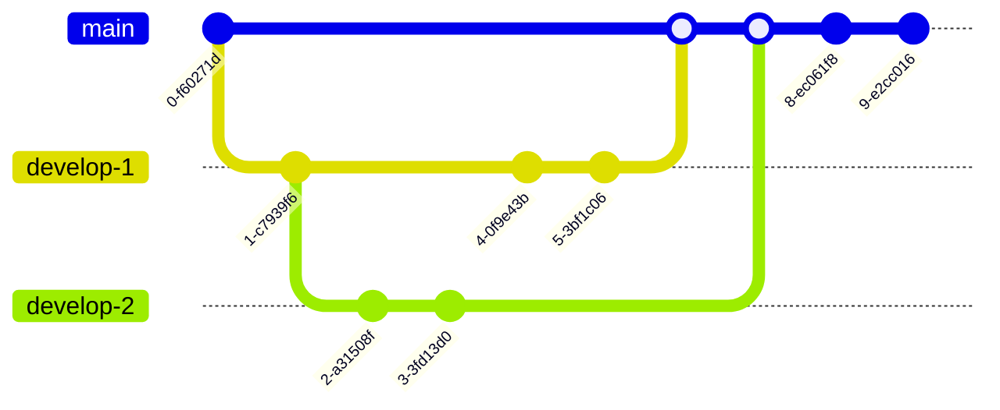

<center> <h2 style="color:Maroon;">Tips and Tricks</h2> </center>
<center> <h6 style="color:Maroon;">by Rashid</h6> </center>


<details>
<summary><b style="color:Maroon;">Windows Subsystem for Linux (WSL)</b></summary>

**Enable the Windows Subsystem for Linux:**
<sub>Open PowerShell as Administrator (Start menu > PowerShell > right-click > Run as Administrator) and enter this command or enable manually from Control Pannel:
<sub>

```powershell
dism.exe /online /enable-feature /featurename:Microsoft-Windows-Subsystem-Linux /all /norestart
dism.exe /online /enable-feature /featurename:VirtualMachinePlatform /all /norestart
```

<sub>Install WSL command and set to WSL 2 by default<sub>

```powershell
wsl --install
wsl --update
wsl --status
wsl --version
wsl --set-default-version 2
```
<sub>Install Windows Subsystem for Linux (WSL) Distribution using Command<sub>

```powershell
wsl --list --online
# install distribution
wsl --install -d <distroName>
# list of distribution
wsl -l -v
# start distribution
wsl -d <distroName>
# logout distribution
wsl --terminate <distroName>
# uninstall distribution with below command and remove from app
wsl --unregister <distroName>
rm -rf <distro location>
```
<sub> default locaiton of online destro:: C:\Users\islam.rashidul\AppData\Local\Packages\CanonicalGroupLimited.Ubuntu22.04LTS_79rhkp1fndgsc\LocalState</sub>

**Enable same/different version multiple distribution in WSL**

```powershell
wsl -l -v
# export current distribution (Ubuntu-22.04)  
wsl --export Ubuntu-22.04 D:\Software\OS\wsl-distribution\ubuntu-empty.tar.gz
# import distribution (Ubuntu-test-base) from local
wsl --import Ubuntu-test-base D:\Software\OS\wsl-distribution\test-base D:\Software\OS\wsl-distribution\ubuntu-empty.tar.gz
wsl -d Ubuntu-test-base
# import distribution (Ubuntu-test-base-2) from local
wsl --import Ubuntu-test-base-2 D:\Software\OS\wsl-distribution\test-base-2 D:\Software\OS\wsl-distribution\ubuntu-empty.tar.gz
wsl -d Ubuntu-test-base-2
```
**or**
<sub>get distribution manually from below link<sub>

https://cloud-images.ubuntu.com/wsl/

<sub>Must use powershell and following command to download the Ubuntu WSL tarball</sub> 

```powershell
Remove-Item alias:curl
# cd to download location D:\Software\OS\wsl-distribution
curl (("https://cloud-images.ubuntu.com",
"wsl/jammy/current",
"ubuntu-jammy-wsl-amd64-wsl.rootfs.tar.gz") -join "/") `
--output ubuntu-jammy-wsl-amd64-wsl.rootfs.tar.gz 
# wsl --import <Distribution Name> <Installation Folder> <Ubuntu WSL2 Image Tarball path>
wsl --import Ubuntu-22.04-test D:\Software\OS\wsl-distribution\test-base-3 D:\Software\OS\wsl-distribution\ubuntu-jammy-wsl-amd64-wsl.rootfs.tar.gz
wsl -l -v
wsl -d Ubuntu-22.04-test
```

<sub>or other version<sub>

```powershell
Remove-Item alias:curl
# cd to download location D:\Software\OS\wsl-distribution
curl (("https://cloud-images.ubuntu.com",
"wsl/lunar/20231219",
"ubuntu-lunar-wsl-amd64-wsl.rootfs.tar.gz") -join "/") `
--output ubuntu-lunar-wsl-amd64-wsl.rootfs.tar.gz
# wsl --import <Distribution Name> <Installation Folder> <Ubuntu WSL2 Image Tarball path>
wsl --import Ubuntu-23.04-test D:\Software\OS\wsl-distribution\test-base-3 D:\Software\OS\wsl-distribution\ubuntu-lunar-wsl-amd64-wsl.rootfs.tar.gz
wsl -l -v
wsl -d Ubuntu-23.04-test
```
<sub>the environment that it has logged in as the root user instead of a custom user that you set up as part of the "base" environment. The custom user exists, but is not configured as the default. You can either start the environment using:<sub>

<a style="color:Maroon;">sample user: u-2304-wsl-node-01</a>


```bash
# add a new user to system:
NEW_USER=<USERNAME>
# add the user to the sudo group and set password:
useradd -m -G sudo -s /bin/bash "$NEW_USER"
passwd "$NEW_USER"
# switch to default instead of root
tee /etc/wsl.conf <<_EOF
[user]
default=${NEW_USER}
[network]
generateResolvConf = false
_EOF
```
<sub>log out and log in again<sub>

```powershell
wsl --terminate <Distribution Name>
wsl -d <Distribution Name>
```

**Issues resolution**

* <sub>ping: www.google.com: Temporary failure in name resolution<sub>

```bash
sudo bash -c 'echo "nameserver 8.8.8.8" > /etc/resolv.conf'
sudo bash -c 'echo "nameserver 8.8.4.4" >> /etc/resolv.conf'
```

</details>


<details>
<summary><b style="color:Maroon;">Docker on WSL and Ubuntu</b></summary>

**install Docker Engine on wsl**

https://docs.docker.com/engine/install/ubuntu/

<sub>Prepare system Remove Docker residue</sub>

```bash
sudo apt-get update
sudo apt-get upgrade
for pkg in docker.io docker-doc docker-compose docker-compose-v2 podman-docker containerd runc; do sudo apt-get remove $pkg; done
sudo apt remove docker-desktop
rm -r $HOME/.docker/desktop
sudo rm /usr/local/bin/com.docker.cli
sudo apt purge docker-desktop
```
<sub>Set up the Docker repository</sub>

```bash
# Add Docker's official GPG key:
sudo apt-get update
sudo apt-get install ca-certificates curl gnupg
sudo install -m 0755 -d /etc/apt/keyrings
curl -fsSL https://download.docker.com/linux/ubuntu/gpg | sudo gpg --dearmor -o /etc/apt/keyrings/docker.gpg
sudo chmod a+r /etc/apt/keyrings/docker.gpg
```

```bash
# Add the repository to Apt sources:
echo \
  "deb [arch=$(dpkg --print-architecture) signed-by=/etc/apt/keyrings/docker.gpg] https://download.docker.com/linux/ubuntu \
  $(. /etc/os-release && echo "$VERSION_CODENAME") stable" | \
  sudo tee /etc/apt/sources.list.d/docker.list > /dev/null
sudo apt-get update
```

<sub>To install the latest version, run:</sub>

```bash
sudo apt-get install docker-ce docker-ce-cli containerd.io docker-buildx-plugin docker-compose-plugin
```
<sub>Or to install Specific version</sub>

```bash
apt-cache madison docker-ce | awk '{ print $3 }'
# list of version for example 5:24.0.0-1~ubuntu.22.04~jammy
VERSION_STRING=5:24.0.0-1~ubuntu.22.04~jammy
sudo apt-get install docker-ce=$VERSION_STRING docker-ce-cli=$VERSION_STRING containerd.io docker-buildx-plugin docker-compose-plugin
```
<sub>Start Docker service</sub>

```bash
sudo service docker start # or sudo systemctl docker start
sudo service docker status # or sudo systemctl docker status
```

<sub>run the hello-world image</sub>

```bash
sudo docker run hello-world
```

<sub>Run Docker as a non-root user</sub>

```bash
USER=<USERNAME> #u-2304-wsl-node-02
sudo groupadd docker

sudo usermod -aG docker $USER
```

<Sub>if error "Docker is not running" found, reason this errors occurs is because Ubuntu 22.04 LTS uses iptables-nft by default. Need to switch to iptables-legacy so that Docker will work again:</Sub>

```bash
sudo update-alternatives --config iptables
# Enter 1 to select iptables-legacy
sudo service docker start
```

**Install docker desktop on ubuntu**

https://docs.docker.com/desktop/install/ubuntu/

<sub>To install docker desktop on nested ubuntu VM need do below steps:
-install ubuntu on hyper-V
-enable hyper-V from powershell
-check kvm in nested ubuntu
</sub>
</details>

<details>
<summary><b style="color:Maroon;">git</b></summary>

```bash
sudo apt install git
git config --global user.name "Your Name"
git config --global user.email "youremail@domain.com"
# set default editor
git config --global color.ui auto
git config --global core.editor "code --wait"
# auto-converting CRLF (carriage return[\r] & line feed[\n])
git config --global core.autocrlf false
git config --global diff.tool vscode

ssh-keygen -t ed25519 -C "your_email@example.com"
```

```powershell
# setup SSH in admin powershell
ssh-keygen -t ed25519 -C "rashed6585@gmail.com"
# start the ssh-agent in the background
Get-Service -Name ssh-agent | Set-Service -StartupType Manual
Start-Service ssh-agent
# add ssh
ssh-add C:\Users\rashe\.ssh\id_ed25519
```

```bash
# Copy the SSH public key to your clipboard.
clip < ~/.ssh/id_ed25519.pub
# or
cat ~/.ssh/id_ed25519.pub | clip
# output
ssh-ed25519 AAAAC3NzaC1lZDI1NTE5BBBIPm9EOXSQ5fNYVtEz40NiggggI3FQZcVmZcuRHGoXqrht rashed6585@gmail.com
# Adding a new SSH key to your GitHub account in setup avater 
```





- create a repository in github eg. project-starship
- main fleet:
```bash
  mkdir project-starship
  echo "command on enterprise ship" > enterprise-fleet.txt
  git init
  git add .
  # or git add main-fleet.txt
  git status -s
  git commit -m "initial enterprise commit"
  echo "action on main ship" >> enterprise-fleet.txt
  git status -s
  git diff
  echo "repair action on main ship" > enterprise-fleet-repair.txt
  # -am is commit all modified files
  git commit -am "commit on enterprise fleet"
  git tag v0.1.0 -m "initial version"
  git log
  git show 234567 # hash name
  # add to remote branch
  git remote add origin https://github.com/rashed6585/project-starship.git
  git branch -M master
  git push -u origin master
  # add branch 
  git branch -M worker
  echo "maintenance on going with worker branch" >> enterprise-fleet-repair.txt
  git commit -m "worker branch created"
  git push -u origin worker
  git checkout -
  git commit -m "merge worker node"
  git merge worker
  # delete branch in local
  git branch -d worker
  # delete branch in remote
  git push https://github.com/rashed6585/project-starship.git --delete worker
  # multiple commit on a single file
  echo "stage for commit-1" >> enterprise-fleet.txt
  echo "stage for commit-2" >> enterprise-fleet.txt
  git add -p
  # merge conflict
  # merge rebase
```

- side-fleet-01:
```bash
  git branch -M dev
  git checkout dev
  echo "command on site ship" > side-fleet.txt

```


    git remote add origin https://github.com/rashed6585/testing-git.git
    git branch -M master
    git push -u origin master
    # git branch -m <old-name> <new-name>
    git branch -m master home
    echo "edit file with branch (home)" >> readme.md
    


- local user-2:
- push local user-1 to local user-2:
- track history


</details>


<details>
<summary><b style="color:Maroon;">other</b></summary>

* **Uninstall / Remove python3 package**
```bash
sudo apt remove python3
sudo apt autoclean && sudo apt autoremove
```
* **Install python3 package**

https://github.com/parafoxia/python-scripts/tree/main

https://vegastack.com/tutorials/how-to-install-python-3-11-on-ubuntu-22-04/

https://phoenixnap.com/kb/how-to-install-python-3-ubuntu
</details>

<details>
<summary><b style="color:Maroon;">common command</b></summary>


```bash
# switch to root user
sudo -i
# check ip
ip addr
ip a
ip addr show eth0 | grep -oP '(?<=inet\s)\d+(\.\d+){3}'
ip addr | grep eth0
# write to file with our opening
echo "hello world" > my_file.txt
# if need to append
echo "hello universe" >> my_file.txt
# apt installed list
sudo apt list --installed
sudo apt list --installed | grep postgres
```
</details>

<details>
<summary><b style="color:Maroon;">tmux terminal</b></summary>


```bash
# get tmux
cd ~
sudo apt update
sudo apt install tmux
# configure Tmux
# install Tmux Plugin Manager
git clone https://github.com/tmux-plugins/tpm ~/.tmux/plugins/tpm
ip a
ip addr show eth0 | grep -oP '(?<=inet\s)\d+(\.\d+){3}'
ip addr | grep eth0
# write to file with our opening
echo "hello world" > my_file.txt
# if need to append
echo "hello universe" >> my_file.txt
# apt installed list
sudo apt list --installed
sudo apt list --installed | grep postgres
```
</details>